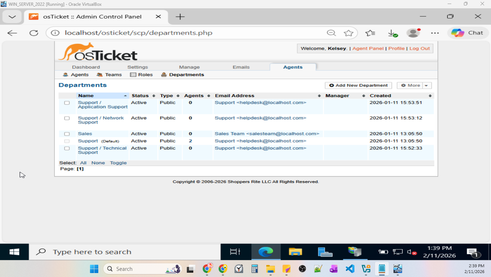

# Phase 2: Configuration & Operational Readiness
This section explains the post-installation configuration steps for osTicket, where the platform was taken from a new installation to a fully functional, multi-department helpdesk environment by implementing role-based access control, SLA plans, ticket categorization, and workflow management to simulate real-world Technical Support Operations.

## Environments & Technologies
- Oracle VirtualBox
- Internet Information Services (IIS)
## Operating System
- Windows Server 2022 (21H2) | Build 20348.587

## Configuration Tasks
- **1. System Configuration:** Company name, default department, ticket settings, date, and timezone configuration.
  
- **2. Roles & Permissions:** user role assignment and department access configuration.
  
- **3. Department Structure for Ticket Routing:**
  -  Technical Support
  -  Network Support
  -  Application Support
  -  Sales

- **4. Structured Help Topics** - the following topics were listed:
  - Password Reset
  - Email Issue
  - Network Outage
  - Unable to Print
  - Access Request
  - New Employee Onboarding
  - Feedback
  - General Inquiry
  - VPN Outage

- **5.Service Level Agreements (SLAs)**
    - Priority Levels & Resolution Times:
      - P1: Critical(2 hours) - Company-wide issues which impact reveneue i.e., Network, Server, or VPN outages that affect all in-house and remote staff.
      - P2: High(8 hours) - Department-specific issues, i.e., application errors, workstation issues, and email access issues.
      - P3: Normal(12 hours) - Non-critical issues affecting the end-users, i.e., access requests, workstation problems, printer issues.
      - P4: Low (24 hours) - For standard user/client requests, i.e., questions and minor changes.
     
- **6. User Onboarding**
  - A new user [Jane Mollineau] was configured for the Tier 1 Technical Support Team.
      
## 1. System Configuration
The platform settings were configured via the Admin Panel. The purpose is to ensure consistency and standardization in the support environment.
[*Admin Panel → Settings*]

Fictional Company Name: Shopper's Rite LLC.

The following **System** settings were applied; 
- Helpdesk Name: Helpdesk Lab v1.0
- Default Department: Support
- Default Time Zone: America / New_ York
- Date & Time Format: Locale Defaults
- Default Schedule:  Monday - Friday 8 am-5 pm with U.S. Holidays

Next, the Ticket Settings were configured as follows: [*Admin Panel → Settings → Tickets*]

- Default Ticket Number format: HDLV1##
- Default Ticket Number Sequence: General Tickets with an increment of 1

- Default Status: Open
- Default Priority: Normal
- Default SLA: Level 4 - Low (24 Hours - Active)
- Default Help Topic: General Inquiry
- Maximum Open Tickets: 5
- Human Verification: Enabled -  to avoid time wastage on spammy or potentially dangerous tickets

## 2. Roles & Permissions (Access Control)
These 4 roles were assigned permissions based on their department to demonstrate user privilege and operational control [*Admin → Staff → Roles*]
- **Helpdesk Technician (Tier 1 Support)**:  Can handle tickets assigned to the Technical Support Department only. No access to make advanced changes.
- **Senior Technician (Tier 2 Support)**: Handles escalated queries assigned to the Technical Support Department only, without full access.
- **IT Manager (Administrator Level)**:  Full Access to all permissions across all departments.
- **Sales Executive**: Can handle tickets assigned to the Sales Department only.

## 3. Department Structure for Ticket Routing
The structured departments were created under the Default Department: Support [*Admin → Agents → Departments*] - the Sales Team uses a separate mailbox.

The relevant teams were then created to facilitate ticket assignments. [*Admin → Agents → Teams*]

## 4. Structured Help Topics

To ensure that all new help topics are accurately assigned and categorized, a **Parent Topic** was assigned, and **Department** was assigned. The appropriate **Priority** and **SLA Plans** were configured, and the **Auto-Assign** was configured for the relevant department.  [*Admin → Manage → Help Topics*]

The end-user will then access the Support Centre to open a new ticket and select the appropriate help topic using the URL: http://localhost/osTicket/

## 5. Service Level Agreements (SLAs)
The following SLAs were set and assigned to each department. [*Admin → Manage → SLA*]

  
### 5.1 SLAs by Department
  - Technical Support → P2 – High (8 hours)
  - Network Support → P1 – Critical (2 hours)
  - Application Support → P2 – High (8 hours)
  - Sales → P3 – Normal (24 hours)

## 6. User Onboarding

**Credentials**
- User 'Jane Mollineau' was created. [*Admin → Agents → Agents*]
- Username: jmollineau
- Password: Sent to the User's Email

**Jane's Access Level**
- Department: Support/ Technical Support
- Role: Helpdesk Technician (Tier 1 Support)

**Jane's Permissions**
This account was configured for limited permissions to make any major changes. 

**Jane's Team Assignment**
- Jane was assigned to the Team: "T1 Technical Support"

## Final Considerations
- User Session Timeout: the *User Session Timeout* was changed from 30 minutes to 0 to avoid having to sign in again and encounter the error shown below;

